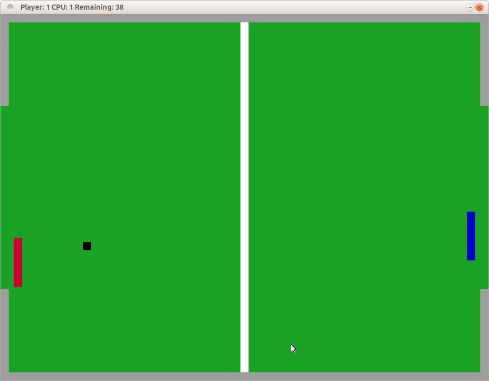

# CPPND: Capstone Pong Repo

This is yet another [Pong game](https://en.wikipedia.org/wiki/Pong) implementation. It was inspired by by Sanjay Madhav's "From Game Programming in C++" (code available [here](https://github.com/gameprogcpp/code/blob/master/Chapter01/Game.cpp)).

## Dependencies for Running Locally
* cmake >= 3.7
  * All OSes: [click here for installation instructions](https://cmake.org/install/)
* make >= 4.1 (Linux, Mac), 3.81 (Windows)
  * Linux: make is installed by default on most Linux distros
  * Mac: [install Xcode command line tools to get make](https://developer.apple.com/xcode/features/)
  * Windows: [Click here for installation instructions](http://gnuwin32.sourceforge.net/packages/make.htm)
* SDL2 >= 2.0
  * All installation instructions can be found [here](https://wiki.libsdl.org/Installation)
  * Note that for Linux, an `apt` or `apt-get` installation is preferred to building from source.
* gcc/g++ >= 5.4
  * Linux: gcc / g++ is installed by default on most Linux distros
  * Mac: same deal as make - [install Xcode command line tools](https://developer.apple.com/xcode/features/)
  * Windows: recommend using [MinGW](http://www.mingw.org/)

## Basic Build Instructions

1. Clone this repo.
2. Make a build directory in the top level directory: `mkdir build && cd build`
3. Compile: `cmake .. && make`
4. Run it: `./Pong`.

## Game Play Instructions

In this version of Pong the human player competes against the cpu. The objective of the game is to score more goals than the adversary. The player or the cpu scores a goal if the ball (the black dot) passes through the openings on the left or the right side of the pitch not limited by the grey walls. After 90 seconds the game is over and who has scored more goals wins.

The human player controls the red paddle on the left side of the field and scores if the ball passes through the goal on the right side. Pressing "w" or up key moves the paddle up, pressing "s" or down key moves the paddle down. The player is able to move the paddle until it reaches the limiting walls at the top or the bottom of the pitch.

The cpu controls the blue paddle on the right side of the screen. The cpu is a cautious player and will not move quite to the top or the bottom. It will only start moving when the ball is in its side of the field (limited by the white vertical line in the middle) and moving towards cpu's goal.

At the begin of the game the ball is at the middle of the field at starts moving towards the player. After a goal it returns to the middle and starts moving to the direction of the scorer.

Be aware that every time the ball bounces off a wall or a paddle, it will slightly increase its velocity.

The score and the remaining time are displayed at the window title. A player might exit game any time by clicking Escape key on the keyboard. There's a slight delay before the game window closes.

Good luck!

## Game settings

There's pong.conf in the `src` folder which allows the user to modify some game settings.

* windowWidth - width of the game window (integer). Default: 960.
* windowHeight - height of the game window (integer). Default: 720.
* lineThickness - width of the paddles, ball dimensions, line width (integer). Default: 16.
* paddleHeight - height of the paddles (integer). Default: 96.
* gameRuntime - runtime of the game in seconds (integer). Default: 90.
* ballXVell - initial x axis velocity of the ball (float). Negative values mean that the ball moves towards player, positive - towards the cpu. Default: -250.0f.
* ballYVell - initial y axis velocity of the ball (float). Negative values mean that the ball moves up, positive - down. Default: 180.0f.

## File Structure

All the source files are in the `src` folder.

* ball.cpp - the representation of the ball which derivates from the MovingObject class.
* config.cpp - loads the game settings from pong.conf.
* controller.cpp - processes the user input (key presses on the keyboard).
* game.cpp - controls and updates the game.
* main.cpp - the main programm file which initialises and runs the game.
* movingobject.cpp - the abstract class to represent moving objects of the game (ball and paddles).
* paddle.cpp - the representation of a paddle which derivates from the MovingObject class.
* pong.conf - game settings (window size, paddle dimensions etc).
* renderer.cpp - uses SDL2 library to render the field, ball and paddles.

## Rubric Points

### Loops, Functions, I/O

* The project demonstrates an understanding of C++ functions and control structures - game.cpp has the most control structures and functions.
* The project reads data from a file and process the data, or the program writes data to a file - config.cpp
* The project accepts user input and processes the input - controller.cpp processes user input and updates the paddle position accordingly.

### Object Oriented Programming

* The project uses Object Oriented Programming techniques - ball.cpp, controller.cpp, game.cpp, movingobject.cpp, paddle.cpp, renderer.cpp.
* Classes use appropriate access specifiers for class members - movingobject.h defines protected and public class members and provides functions to access them.
* Class constructors utilize member initialization lists - ball.h and ball.cpp as well as paddle.h and paddle.cpp.
* Classes abstract implementation details from their interfaces - game.cpp
* Classes encapsulate behavior - ball.cpp, paddle.cpp - game.cpp updates Ball and Paddle class members through methods.

### Memory Management
* The project makes use of references in function declarations - controller.cpp line 4, game.cpp line 30.
* The project uses destructors appropriately - renderer.cpp line 33.
